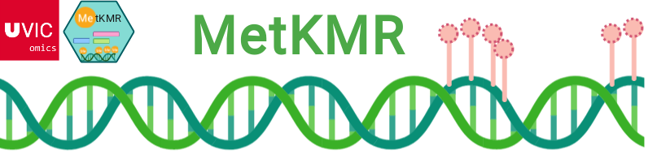
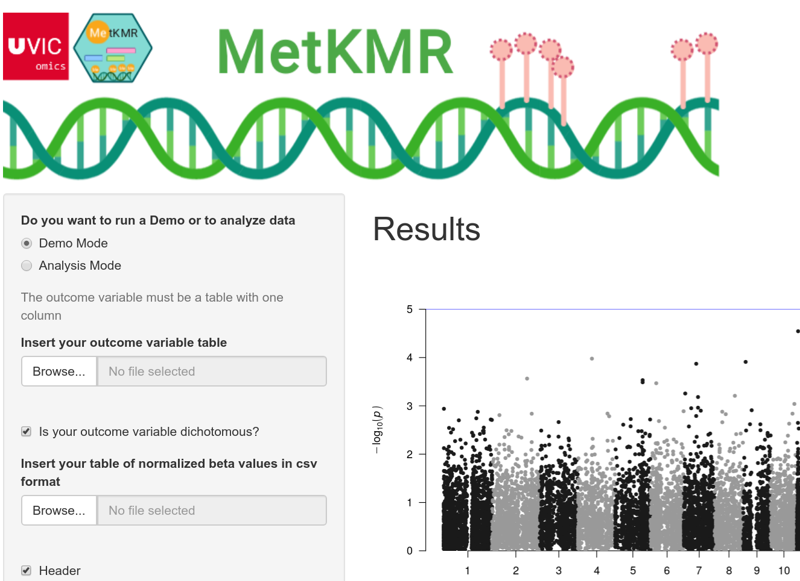
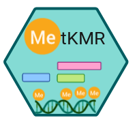

# MetKMR
 R package for the detection of differentially methylated regions through a Kernel regression sliding-window approach 


<center>  </center>

## How to install?
Using devtools<br>
```
# Installing the files in the repository
devtools::install_github(repo="UVic-omics/MetKMR/MetKMR_1.0")

# Loading the library
  library("MetKMR")
```
Manually
<A HREF="https://github.com/UVic-omics/MetKMR/blob/master/MetKMR_1.0.tar.xz"> Package </A>

## What is MetKMR?
There are many differential methylation analysis packages available already, but the majority of them are focused on testing individual sites and composing differentially methylated regions. In this current work an alternative one is proposed, based on a slidingwindow approach with association tests between the generated intervals and the phenotype, using kernel metrics constructed with distance metrics via a semi-parametric kernel machine regression framework, by adapting the Microbiome Regression-based Kernel Association Test (MiRKAT) package.
The software, written in R programming supports many types of methylation data from Illumina microarrays to Biseq data.

## Running `MetKMR`

To start using `MetKMR` we recomend to:

- Read the submitted manuscript [...]
- Use the `help()` functions for getting a detailed instructions of their
  use.
- Read the associated vignettes and tutorials . 
 <br>
 
 #### First Tutorial: Analyzing a epigenomic experiment (450K) in which the outcome variable is dichotomous (Healthy vs Hungtinton)

<A HREF="https://github.com/UVic-omics/MetKMR/blob/master/HD_example.pdf"> First tutorial </A><br>
 <A HREF="https://www.dropbox.com/s/00d96vq5k2k4kdw/files_tutorial1.zip?dl=0"> First tutorial data files </A>
<br>
#### Second Tutorial: An interactomic approach based on combining epigenomic (450K) and transcriptomic data (RNA-Seq) from the Genome Cancer Atlas Project for the study of colorrectal cancer progression. 
<A HREF="https://github.com/UVic-omics/MetKMR/blob/master/interactomics.pdf"> Second tutorial </A>
<br>
#### Third Tutotial Example of how to annotate and normalize 850K EPIC data to analyze it with MetKMR (Tuberculosis patients vs hHealthy controls)
 Includes a pipeline for preprocessing and normalizing data and to obtain the annotation data frame<br>
<A HREF="https://github.com/UVic-omics/MetKMR/blob/master/epic.pdf"> Third tutorial </A>
<br>

## SHINY APP : GUI user interface
Do you like pushing buttons? If you prefer using an app than running a script  MetKMR has it own shiny app that can be download from here:

<A HREF="https://www.dropbox.com/s/mecamr1c16wti8c/MetKMR_shinyapp_final.zip?dl=0"> MetKMR shiny App </A>

You can download some examples of how to format your data for using the shiny app from here:
<A HREF="https://www.dropbox.com/s/ykg9hbmwfc3o0ys/data_for_trying_the_app.zip?dl=0"> MetKMR shiny App inputs</A>

  <br>


## IMPORTANT
Despite of the fact that MetKMR has been designed to not "devour" RAM and avoid RAM crush, depending on the kind of  analysis you are performing and how many CpGs you are testing it could take a lot of time. Specially if you use a machine with very low RAM memory. But you don't need a cluster, for instance all of the analysis of the tutorials were tested in the following computers :

- HP pavillion laptop with Windows Vista 10 , 8 GB of ram and 4 cores 
- A Lenovo L450 laptop with UBUNTU 18, 16GB of ram and 4 cores 
- A custom high performance desktop computer with UBUNTU 18, 64GB of ram and 16 cores 

##  Who is responsible of this package?
MetKMR project was developed by Carlos Martínez Mira , Ruth Barral Arca , Alejandro Gil and supervised by M. Luz Calle Rosingana.  Ruth is the mantainer of the package (barralarcaruth@gmail.com) if you have any doubt or suggestion do not hesitate to contact her.

##  Corrected bugs since version 1.0
-error in ApplyRKAT: dplyr did not longer support a return within a dplyr:do <br>
-error in PlotManhattan :  started yielding the error " in .f(.x i ...) pval not found"<br>
-toSQLite:problems when importing previously created sql files <br>
-error in toSQLite:   some dplyr functions  have been moved to dbplyr<br>
-error in createintervals: also due to changes in dplyr <br>


<center>  </center>
